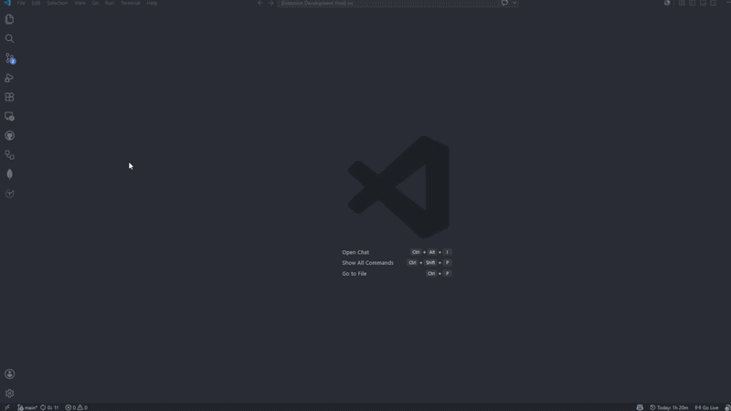
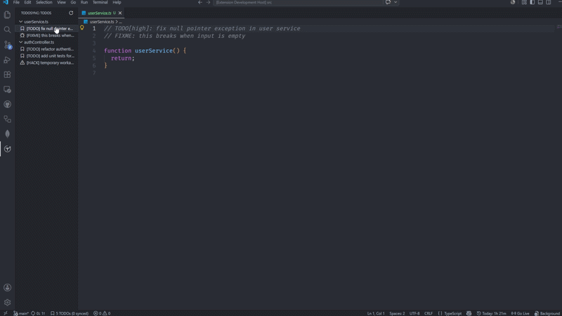
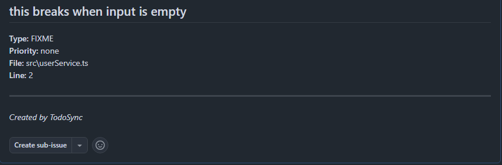
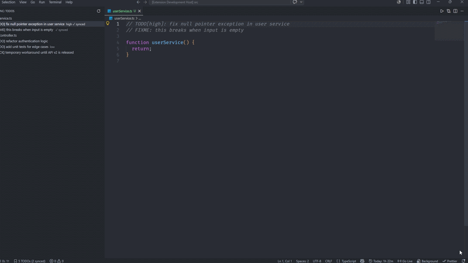
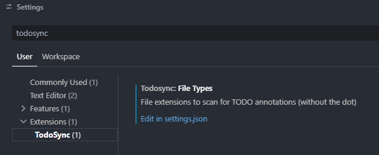
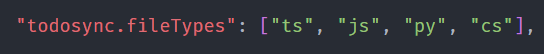
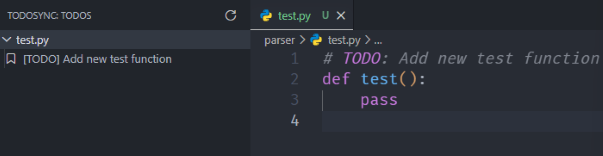
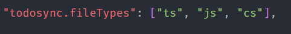
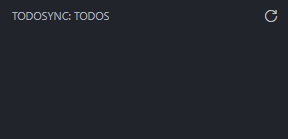

# TodoSync

Sync your TODO annotations to GitHub Issues directly from VS Code.

[](LICENSE)
[](https://marketplace.visualstudio.com/items?itemName=importdevcoffee.todosync)

---

## Overview

TodoSync scans your workspace for `TODO`, `FIXME` and `HACK` annotations and lets you push them directly to GitHub Issues without leaving VS Code. Track what's synced, jump to any annotation in one click, and keep your code and issue tracker in sync.

---

## Demo

### Sidebar & Tree View



### Creating GitHub Issues





### Status Bar



---

## Features

- Scans your entire workspace for `TODO`, `FIXME` and `HACK` annotations
- Sidebar panel listing all TODOs grouped by file
- Click any TODO to jump directly to the file and line
- Right-click any TODO to create a GitHub Issue instantly
- Priority metadata support via `TODO[high]`, `TODO[medium]`, `TODO[low]`
- Visual sync indicator showing which TODOs have already been pushed
- Status bar showing total and synced TODO count
- Manual refresh button in the sidebar
- Configurable file types via VS Code settings

---

## Annotation Syntax

```ts
// TODO: basic annotation
// TODO[high]: high priority task
// TODO[medium]: medium priority task
// TODO[low]: low priority task
// FIXME: something that needs fixing
// HACK: temporary workaround
```

Parsed automatically across your configured file types.

---

## Configuration

Open VS Code settings (`Ctrl+,`) and search for `todosync`.



### File Types

By default TodoSync scans `.ts`, `.js`, `.py` and `.cs` files. Add or remove extensions to match your project.

For example:

```json
"todosync.fileTypes": ["ts", "js", "py", "cs", "go", "java"]
```



With a Python file open, TODOs are picked up automatically:



Removing `py` and saving `settings.json`, then clicking refresh clears Python TODOs from the sidebar:





---

## Requirements

- VS Code 1.120.0 or higher
- A GitHub account (authentication handled via VS Code built-in GitHub login)

---

## Usage

1. Open a workspace in VS Code
2. Click the TodoSync icon in the activity bar
3. All TODOs appear in the sidebar grouped by file
4. Click a TODO to jump to it in the editor
5. Right-click a TODO and select **Create GitHub Issue**
6. The TODO is marked as synced. No duplicate issues will be created.

---

## How It Works

TodoSync uses VS Code's built-in GitHub authentication. No Personal Access Token setup required. On first use you will be prompted to sign in to GitHub. Your repository owner and name are detected automatically from your workspace git remote.

---

## Roadmap

- [ ] Bulk push multiple TODOs as issues at once
- [ ] Configurable file types to scan
- [ ] Open linked GitHub Issue directly from the sidebar

---

## Contributing

Found a bug or want to suggest a feature? PRs and issues are welcome.

[Report a Bug](https://github.com/importdevcoffee/todosync/issues) · [Request a Feature](https://github.com/importdevcoffee/todosync/issues) · [Changelog](CHANGELOG.md)

---

## License

MIT © [manamasu](https://github.com/manamasu)
